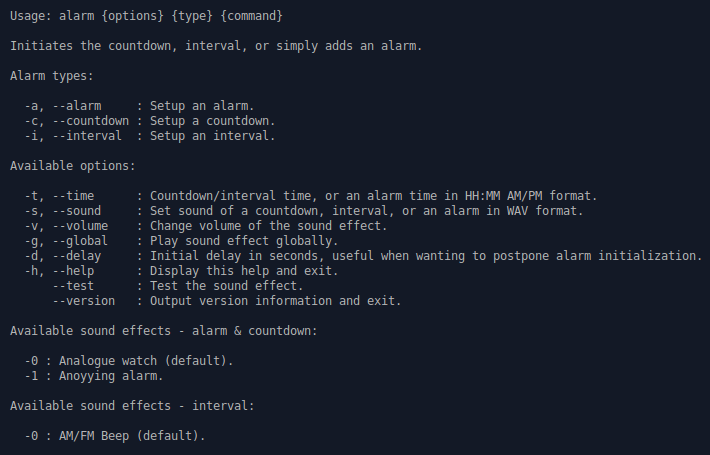

# Alarm

Alarm is a simple BASH script for creating alarms, countdowns, and intervals with optional command execution at the end.



Script has been tested on the following distributions:

* Ubuntu 18.04
* Debian 9.5

[](https://www.paypal.me/DjordjeJocic)

## Versioning Scheme

I use a 3-digit version identifier, for example 1.0.2. These digits have the following meaning:

* The first digit (1) specifies the major version number.
* The second digit (0) specifies the minor version number.
* The third digit (2) specifies the patch version number.

## Examples

This script was made for Debian and Debian-based distributions but it should work on other Linux distributions - as long as the audio and MIDI functionality on them is provided by ALSA.

### Example 1 - Testing Sound

Sound of a countdown, interval, or an alarm can be easily tested prior to initialization using a "--test" flag.

```bash
bash ./alarm.sh --test -a
```

### Example 2 - Countdown

In this example, we are starting a 10s countdown,= after which a generic alarm sound will be played.

```bash
bash ./alarm.sh -t 10s -c
```

### Example 3 - Delayed Countdown

Sometimes you may want to start a countdown after a slight delay, in this example we are starting a 10m countdown with a 10 second delay. Like before, a generic alarm sound will be palyed after the countdown.

```bash
bash ./alarm.sh -t 10m -d 10 -c
```

### Example 4 - Countdown & Command

Usually, you would want to execute a certain command after a countdown, interval or an alarm. This example shows you how to do just that, execute an arbitrary command after a 10s countdown.

```bash
bash ./alarm.sh -t 10s -c "echo 'Hello World!'"
```

## Alias

If you plan to use the script everyday, you should probably create an alias.

### Temporary Alias

```bash
alias alarm="/path/to/your/folder/alarm.sh"
```

### Permanent Alias

```bash
echo alias alarm="/path/to/your/folder/alarm.sh" >> ~/.bash_aliases

## Installation

Alternatively, you can add my personal APT repository to your machine and install **Alarm** like you would anything else.

Add a repository.

```bash
wget -nc https://www.djordjejocic.com/files/apt/Release.key
sudo apt-key add Release.key
sudo echo "deb http://apt.djordjejocic.com/ general main" >> "/etc/apt/sources.list"
sudo apt-get update
```

Install project.

```bash
apt-get install alarm
```

**Note:** Keep in mind that **Alarm** isn't yet available in my personal repository - mostly because it isn't up and running yet. ;)

## Support

Please don't hessitate to contact me if you have any questions, ideas, or concerns.

My Twitter account is: [@jocic_91](https://www.twitter.com)

My support E-Mail address is: <support@djordjejocic.com>
