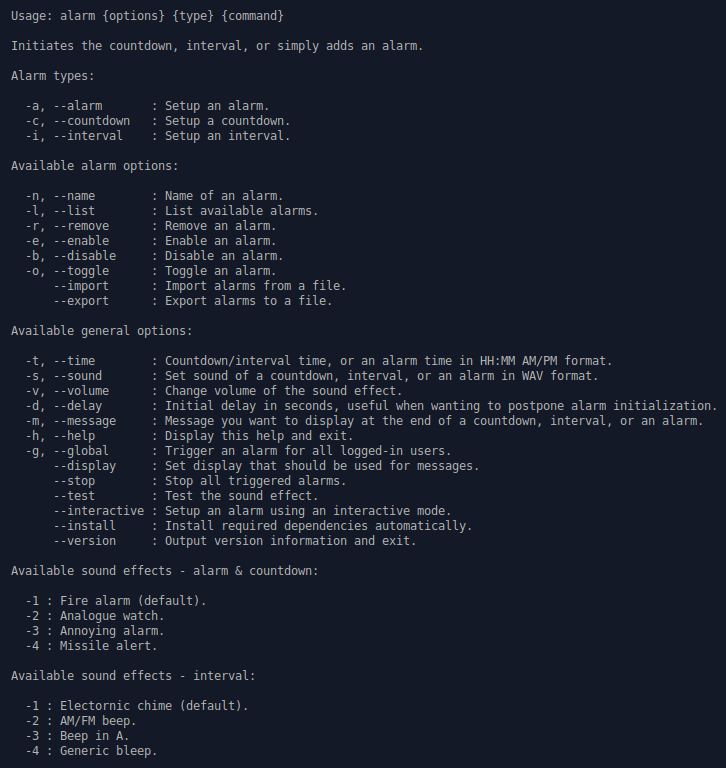

# Alarm

Alarm is a simple BASH script for creating alarms, countdowns, and intervals with optional command execution at the end.



Script has been tested on the following distributions:

* Ubuntu 18.04
* Debian 9.5

[](https://www.paypal.me/DjordjeJocic)

## Versioning Scheme

I use a 3-digit [Semantic Versioning](https://semver.org/spec/v2.0.0.html) identifier, for example 1.0.2. These digits have the following meaning:

* The first digit (1) specifies the MAJOR version number.
* The second digit (0) specifies the MINOR version number.
* The third digit (2) specifies the PATCH version number.

Complete documentation can be found by following the link above.

## Examples

This script was made for Debian and Debian-based distributions but it should work on other Linux distributions - as long as the audio and MIDI functionality on them is provided by ALSA.

### Example 1 - Testing Sound

Sound of a countdown, interval, or an alarm can be easily tested prior to initialization using a "--test" flag.

```bash
bash ./alarm.sh --test -a
```

### Example 2 - Countdown

In this example, we are starting a 10s countdown, after which a generic alarm sound will be played.

```bash
bash ./alarm.sh -t 10s -c
```

### Example 3 - Interval

Starting an interval is just as easy, in this example we are starting an interval that will play a generic alarm sound after each minute.

```bash
bash ./alarm.sh -t 1m -i
```

Alternatively, you can start an interval with varying time. First interval will trigger an alarm in 1m, second in 2m, and so on indefinitely.

```bash
bash ./alarm.sh -t 1m,2m,3m -i
```

**Note:** Keep in mind that intervals run idefinitely so in order to stop them you need to press CTRL + C or kill it using your prefered method.

### Example 4 - Alarm

To create an alarm that will be triggered at ex. 07:00 AM you simply need to issue the following command.

```bash
bash ./alarm.sh -t "07:00 AM" -a
```

**Note:** Command above will create an appropriate CRON job, and to remove it you need to use **crontab -e** command.

### Example 5 - Initialization Delay

Sometimes you may want to start a countdown after a slight delay, in this example we are starting a 10m countdown with a 10 second delay. Like before, a generic alarm sound will be palyed after the countdown.

```bash
bash ./alarm.sh -t 10m -d 10 -c
```

### Example 6 - Command Execution

Usually, you would want to execute a certain command after a countdown, interval or an alarm. This example shows you how to do just that, execute an arbitrary command after a 10s countdown.

```bash
bash ./alarm.sh -t 10s -c "echo 'Hello World!'"
```

### Example 7 - Alternative Sound Effect

You can easily change the default sound effect by providing an ID of a built-in sound effect.

```bash
bash ./alarm.sh -t 10s -s 2 -c
```

Or you can, alternatively, just point to your own sound effect.

```bash
bash ./alarm.sh -t 10s -s /path/to/your/folder/effect.wav -c
```

### Example 8 - Sound Volume

Flag "-v" is used to temporarily change the master volume during the alarm to a percentage of your choosing. It is a great way to avoid missing an alarm.

```bash
bash ./alarm.sh -t 10s -v 100 -c
```

### Example 9 - Displaying Messages

You can display a custom message when the alarm is triggered using the "-m" flag.

```bash
bash ./alarm.sh -t 10s -m "My alarm message!" -c
```

### Example 10 - Global Alarms

If you want to set a countdown, interval, or an alarm that will trigger for all logged-in users, you should use the "--global" flag.

```bash
bash ./alarm.sh --global -t 1m -c
```

### Example 11 - Dependency Installation

**Alarm** doesn't have a lot of dependencies but, in any case, there's a way to install them quickly and effortlessly.

```bash
bash ./alarm.sh --install
```

## Alias

If you plan to use the script everyday, you should probably create an alias.

### Temporary Alias

```bash
alias alarm="/path/to/your/folder/alarm.sh"
```

### Permanent Alias

```bash
echo alias alarm="/path/to/your/folder/alarm.sh" >> ~/.bash_aliases
```

## Installation

Alternatively, you can add my personal APT repository to your machine and install **Alarm** like you would anything else.

Add a repository.

```bash
wget -nc https://www.djordjejocic.com/files/apt/Release.key
sudo apt-key add Release.key
sudo echo "deb http://apt.djordjejocic.com general main" >> "/etc/apt/sources.list"
sudo apt-get update
```

Install project.

```bash
apt-get install alarm
```

## Support

Please don't hessitate to contact me if you have any questions, ideas, or concerns.

My Twitter account is: [@jocic_91](https://www.twitter.com)

My support E-Mail address is: <support@djordjejocic.com>

## Copyright & License

Copyright (C) 2018 Đorđe Jocić

Licensed under the MIT license.
